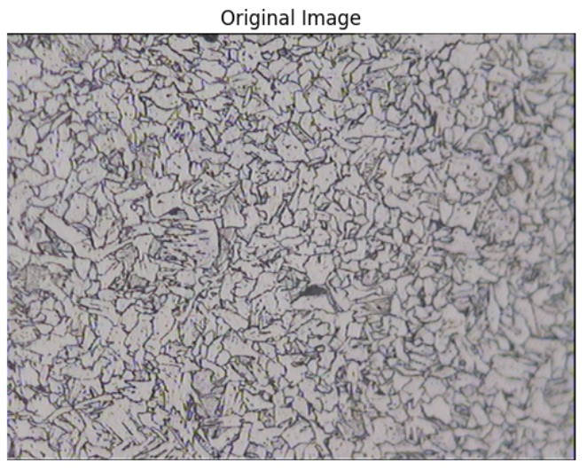
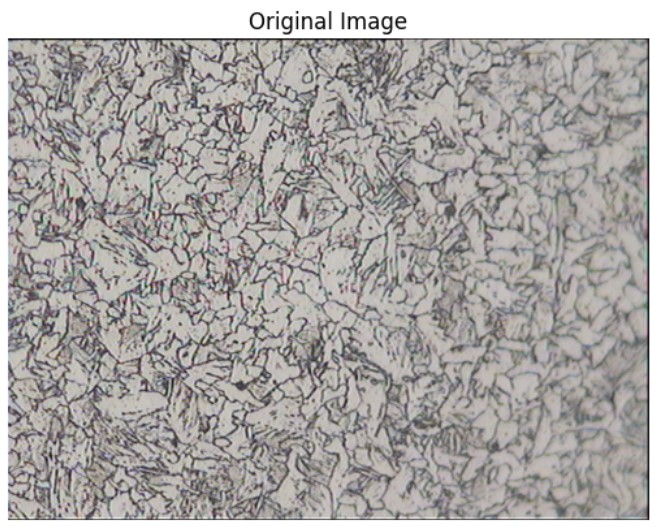

# 🧪 Grain Size Analysis using Python
> A Python-based tool to automatically detect and analyze grain structures in microscopic images.

This project focuses on analyzing the **size of grains** in microscopic images. In such images, *grains* are small, closed regions that form on metal surfaces. Our primary goal is to compute the **average size of grains** in a given image using image processing techniques in Python.

## 📚 Table of Contents
- [Overview](#-overview-of-the-pipeline)
- [Applications](#-applications-of-this-model)
- [Benefits](#-benefits)
- [FAQs](#-frequently-asked-questions-faqs)
- [Future Improvements](#-future-improvements)
- [Technologies Used](#-technologies-used)
- [Sample Results](#-sample-results)

---

## 🔍 Overview of the Pipeline

### 📷 Step 1: Reading the Image

* The image is first converted to **grayscale**, which transforms it into a 2D array where each pixel value represents intensity (brightness).

---

### 🔧 Step 2: Removing Noise

Grain images often contain different types of noise, such as salt-and-pepper, Gaussian, or speckle noise. We experimented with multiple filtering techniques:

* **Gaussian Filter**
  Blurs the image using a weighted average of neighboring pixels. It was fast but caused edge distortion.

* **Median Filter**
  Replaces each pixel with the median of its neighborhood. Effective for salt-and-pepper noise, but computationally expensive and may alter the image structure.

* **Non-Local Means (NLM) Filter** ✅
  Our final choice. This filter preserves grain boundaries while effectively reducing noise by comparing patches of the image rather than individual pixels.

---

### 🌓 Step 3: Thresholding

We used **Otsu’s Thresholding** to segment the grains from the background:

* Pixels with intensity above the threshold are set to 255 (white = grain)
* Others are set to 0 (black = background)

This creates a **binary mask**, making grains clearly distinguishable from the background.

---

### 🏷️ Step 4: Masking and Labeling Grains

We labeled each grain using:

* `ndimage.label()` from `scipy.ndimage`: assigns a unique label to each connected region.
* `color.label2rgb()` from `skimage`: visualizes each labeled grain with a unique color for clarity.

---

### 📐 Step 5: Calculating Average Grain Area

Using the labeled mask, we applied:

* `regionprops()` from `skimage.measure`: to extract properties like area for each grain.

The **average grain area** is then calculated by dividing the total area by the number of grains detected.

---

## 🌍 Applications of This Model

| Industry                  | Use Case                                                            |
| ------------------------- | ------------------------------------------------------------------- |
| **Material Science**      | Analyze metal structures to detect flaws and enhance durability     |
| **Agriculture**           | Count and assess seeds/grains for quality and yield                 |
| **Geology**               | Study soil and rock textures for structural and historical analysis |
| **Pharmaceuticals**       | Ensure particle uniformity for consistent drug performance          |
| **Environmental Science** | Detect microplastics or particles in air/water samples              |
| **Forensics**             | Analyze trace particles for crime investigation                     |

---

## 💡 Benefits

* ✅ **Automated segmentation** reduces manual effort
* ✅ **Improved accuracy** in high-density and noisy images
* ✅ **Scalable** to large datasets
* ✅ **Adaptable** across different image types and industries

---

## ❓ Frequently Asked Questions (FAQs)

### 🔍 General

**Q1. What is the primary purpose of this model?**
A: Segmenting and labeling grains in images for analysis in scientific and industrial fields.

**Q2. Which industries can benefit?**
A: Material science, agriculture, geology, pharmaceuticals, environmental science, and forensics.

**Q3. How does the model improve efficiency?**
A: It automates image segmentation, reducing manual effort and improving consistency.

**Q4. Can the model adapt to different image types?**
A: Yes, with enhancements like adaptive parameter tuning and machine learning integration.

---

### ⚙️ Technical

**Q1. What algorithm is used for segmentation?**
A: A combination of denoising (NLM filter) and thresholding (Otsu’s method).

**Q2. How are colors assigned to grains?**
A: Post-segmentation using `label2rgb()`, but improvements are planned to ensure distinct colors.

**Q3. What challenges were encountered?**
A: Over-/under-segmentation, color overlap, and the need for parameter fine-tuning.

**Q4. Can it handle overlapping grains?**
A: Not reliably yet. This is a known limitation being addressed with advanced segmentation techniques.

**Q5. How is noise handled?**
A: Using the NLM filter, which preserves grain boundaries while removing various noise types.

**Q6. What metrics are used to evaluate performance?**
A: Metrics like precision, recall, Jaccard index, and Dice coefficient.

**Q7. Can the model process high-density images?**
A: Yes, but may struggle with labeling color similarity; enhancements are ongoing.

**Q8. Does it support real-time analysis?**
A: Not currently. Speed improvements via GPU acceleration are being explored.

**Q9. Can it handle multi-scale grains?**
A: Yes, but requires tuning to ensure small and large grains are segmented accurately.

**Q10. How can machine learning help?**
A: ML can be used to automatically select optimal parameters based on image characteristics, improving generalization and robustness.

---

## 🚀 Future Improvements

* Adaptive thresholding based on local pixel neighborhoods
* Deep learning-based segmentation models (e.g., U-Net)
* Real-time processing support
* Unique color assignment using rule-based algorithms
* Interactive GUI for manual corrections

---

## 🛠️ Technologies Used

* Python 3.x
* NumPy, SciPy
* OpenCV
* scikit-image
* Matplotlib

---

## 🖼️ Sample Results

### 🔹 Image 1: Grain Analysis

#### ✅ Original Image

#### ✅ Denoised Image (Non-Local Means)

#### ✅ Thresholded Binary Mask

#### ✅ Color-Labeled Grain Clusters

#### ✅ Final Computed Average Grain Area

> 📊 **Average Grain Area:** `584.44` pixels² (approx.)

---

### 🔹 Image 2: Grain Analysis

#### ✅ Original Image

#### ✅ Thresholded Binary Mask

#### ✅ Color-Labeled Grain Clusters

#### ✅ Final Computed Average Grain Area

> 📊 **Average Grain Area:** `505.97` pixels² (approx.)

---
